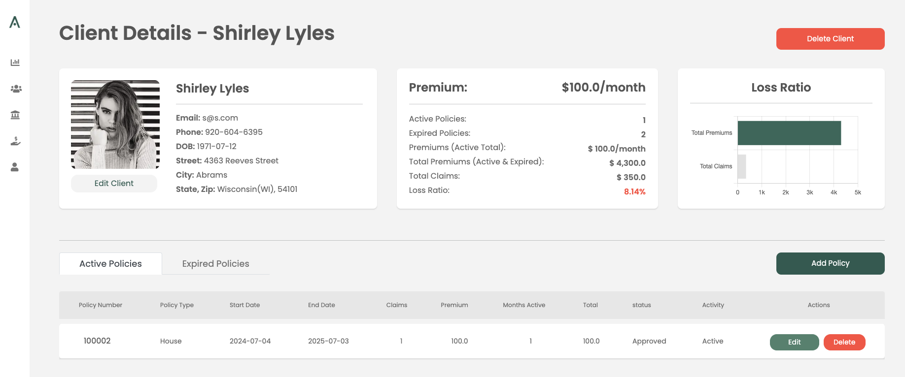
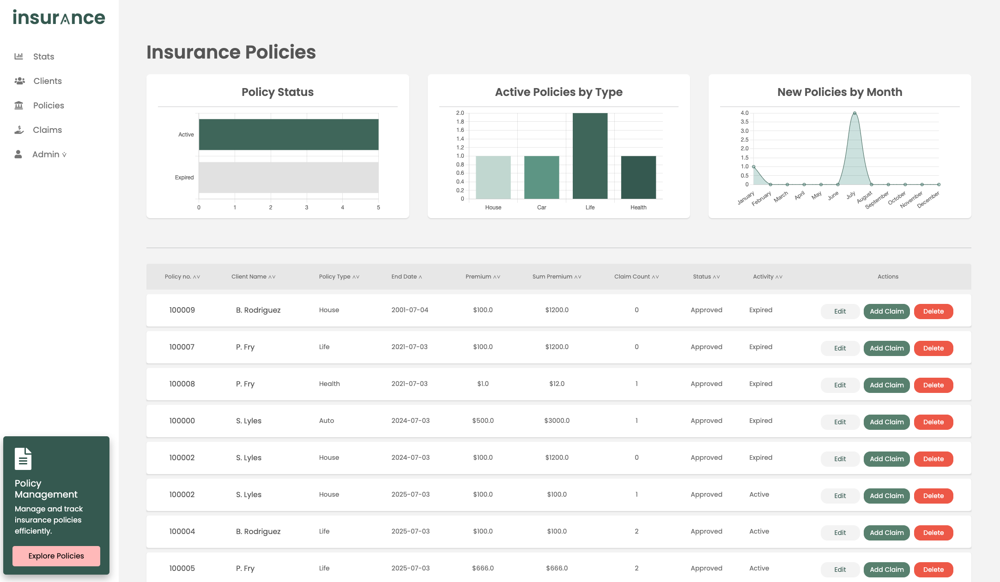

<div align="center"></div>

## What is it?
**insur⟑nce** is a final web application project for IT-networks, it's a fully responsive web application that **demonstrates** the functionalities of an insurance management system. It is designed to efficiently manage insurance processes, including handling client requests, policies, claims, and administrative tasks. The application focuses on usability, security, and in-detail data insights to deliver a reliable solution for insurance management.

<div align="center"></div>

## Main Features
- **Fully Responsive Design:** Optimized for desktop use.
- **Intuitive Management:** Easy overview and management of insured lists, policies, and claims.
- **Dynamic Table Sorting:** Simplifies data exploration and organization.
- **Efficient CRUD Operations:** Create, read, update, and delete user profiles and insurance policies seamlessly.
- **User Role Management:** Control data access and permissions effectively.
- **Secure Login and Registration:** Password hashing for enhanced security.
- **Real-Time Alerts:** Notifications for requests, ending policies, and new claims.
- **Executive Summary Dashboard:** High-level overviews and insights.
- **Extensive Data Visualization:** Charts and statistics for in-depth analysis.


## Technical Implementations
- **CRUD Capabilities:** Manage insured individuals, policies, and claims.
- **MVC Pattern:** Enhanced scalability and efficient code organization.
- **Libraries Used:** Flask, Jinja2, Werkzeug, SQLite3, and more.
- **SQL Database:** Efficient management and overview of insured lists, policies, and claims.

    

## How to Run
To run the insur⟑nce application, open your terminal and type:

### 1. Create the virtual environment
```bash
python -m venv .venv      
```
### 2. Activate the environment

```bash
source .venv/bin/activate 
```
### 3. Install dependencies
```bash
pip install -r requirements.txt  
```
### 4. Create the database OPTIONAL (demo db is included!) 
```bash
cd flask_app
sqlite3 insurance.db    
```
### 5. Start the server
```bash
python run.py  	     
```
These commands will create your environment, db (if needed) and start the server, and you can access the application in your web browser.

# Quick start

## How to Sign In
#### Admin:
- Email: **admin**
- Password: **admin**

#### Fictional Characters:
- Email: **first_name@last_name.com**
- Password: **name**


## 10 minutes to **insur⟑nce**
This section will guide you through the basic functionalities of the insur⟑nce application.

### CRUD Client

#### Create a Client

**Admin:** To create a new client, navigate to the "Clients" section and click on the "Add New Client" button. Fill in the required details in the form and click "Submit." The new client will be added to the database and displayed in the clients list.

**Client:** As a client you can register yourself in the welcome page, where you fill in the required details in the form and click "Submit."

#### Read Client Information

**Admin:** To view a client's information, go to the "Clients" section and click on the client's name or the row in the table. This will open client details page a detailed view of the client's profile, including all relevant information.

**Client:** To view a client's information, go to the "My Details" section. This will open client details page a detailed view of the client's profile, including all relevant information.

#### Update Client Information

**Admin:** To update a client's details, navigate to the "Client Details" section and click the "Edit Client" button. Make the necessary changes in the form and click "Submit" to update the client's information.

**Client:** To update a client's details, navigate to the "My Details" section and click the "Edit Client" button. Make the necessary changes in the form and click "Submit" to update the client's information.

#### Delete a Client

**Admin Only:** To delete a client, go to the "Clients" or to the "Client Details" section and click the "Delete" button next to the client you wish to remove. Confirm the deletion in the popup dialog. The client will be removed from the database.

---
### CRUD Policy

<div align="center"></div>

#### Create a Policy

**Admin:** To create a new policy, navigate to the "Clients" or to the "Client Details" section and click on the "Add Policy" button. Fill in the policy details in the form and click "Submit." The new policy will be added to the database.

**Client:** To **request a new policy**, navigate to the "Client Details" section and click on the "Request Policy" button. Fill in the policy details in the form and click "Submit." The requested policy will be reviewed and accepted or denied.

#### Read Policy Information

**Admin:** To view policy information, go to the "Policies" section and click on the policy number or the row in the table. This will display a detailed view of the policy, including all relevant information.

**Client:** To view policy information, go to the "My Policies" section and click on the policy number or the row in the table. This will display a detailed view of the policy, including all relevant information.

#### Update Policy Information

**Admin Only:** To update a policy, navigate to the policy's detailed view and click the "Edit" button. Make the necessary changes in the form and click "Submit" to update the policy.

#### Delete a Policy

**Admin Only:** To delete a policy, go to the "Policies" section and click the "Delete" button next to the policy you wish to remove. Confirm the deletion in the popup dialog. The policy will be removed from the database.

#### Renew a Policy:

**Admin Only:** If a policy is expired, a **renew button** will appear next to the policy in the expired policies section in the client details. After renewing the policy, a new copy of the policy will be created with a starting date of 'today'. The old policy will be kept in expired policies for reference.

---
### CRUD Claim

#### Create a Claim

**Admin:** To create a new claim, navigate to the "Policies" section and click on the "Add Claim" button. Fill in the claim details in the form and click "Submit." The new claim will be added to the database. Claims are devided into 4 sections, they reflect the state of the claim.
(only PAID claims are used in LOSS RATIO calculation)

**Client:** To create a new claim, navigate to the "My Policies" or "My Details " section and click on the "Add Claim" button. Fill in the claim details in the form and click "Submit." 

#### Read Claim Information

**Admin:** To view claim information, go to the "Claims" section and click on the row in the table. This will display a detailed view of the claim, including all relevant information.

**Client:** To view claim information, go to the "My Claims" section and click on the row in the table. This will display a detailed view of the claim, including all relevant information.

#### Update Claim Information

**Admin:** To update a claim, navigate to the "Claims" section or claim's detailed view and click the "Edit" button. Make the necessary changes in the form and click "Submit" to update the claim.

**Client:** To update a claim, navigate to the "My Claims" section or claim's detailed view and click the "Edit" button. Make the necessary changes in the form and click "Submit" to update the claim. (Only NEW claims can be changed!)

#### Delete a Claim

**Admin:** To delete a claim, go to the "Claims" section and click the "Delete" button next to the claim you wish to remove. Confirm the deletion in the popup dialog. The claim will be removed from the database.

**Client:** To delete a claim, go to the "My Claims" section or claim's detailed view and click the "Delete" button. Confirm the deletion in the popup dialog. The claim will be removed from the database. (Only NEW claims can be deleted!)

---
### Executive Dashboard

The Executive Dashboard provides a high-level overview of key metrics and insights, helping administrators make informed decisions based on real-time data. It includes visualizations like pie charts, bar charts, averages and graphs to depict trends and statistics crucial for strategic planning.

---


## License

MIT

